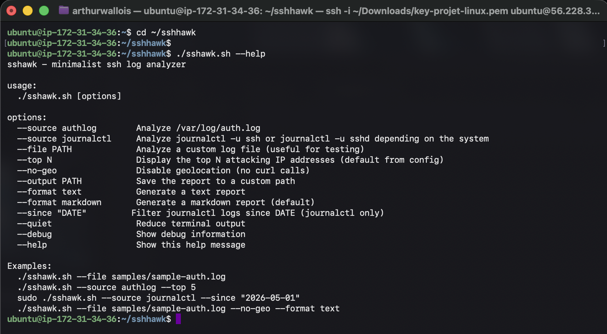
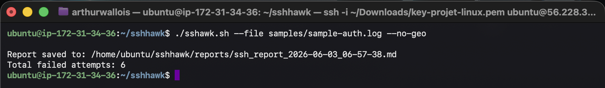
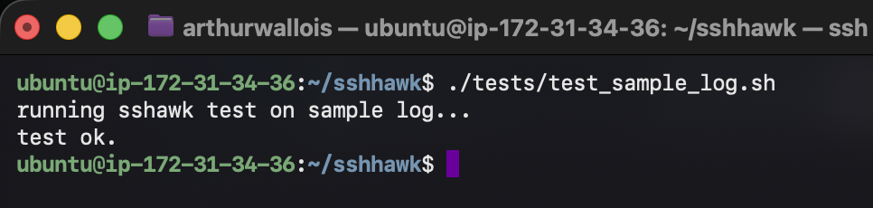
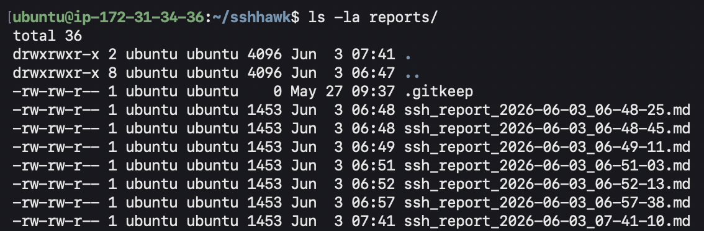
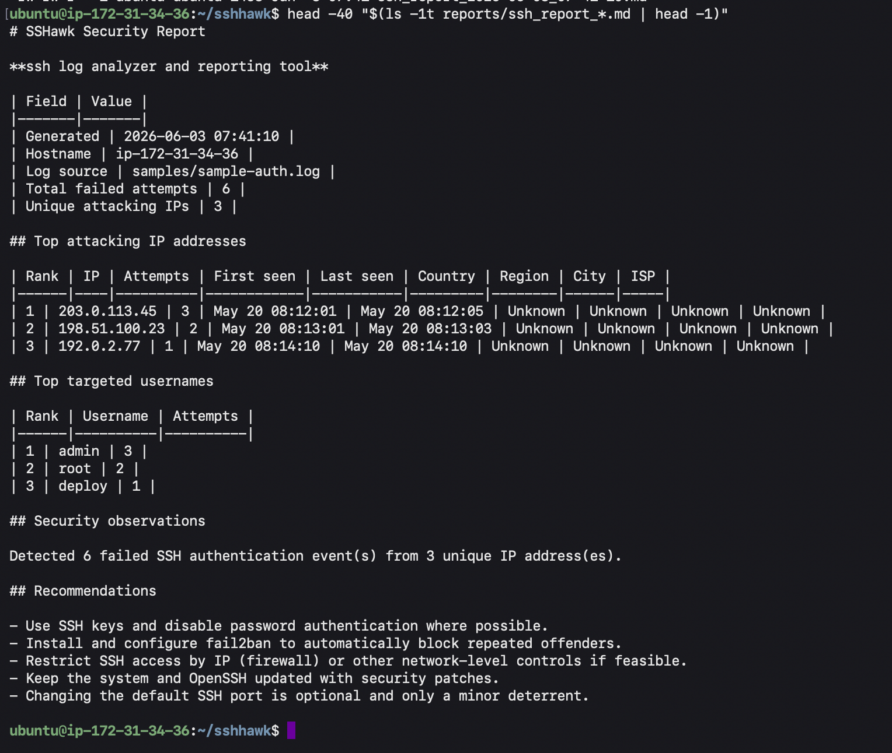
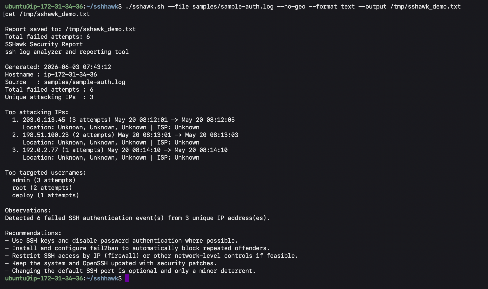
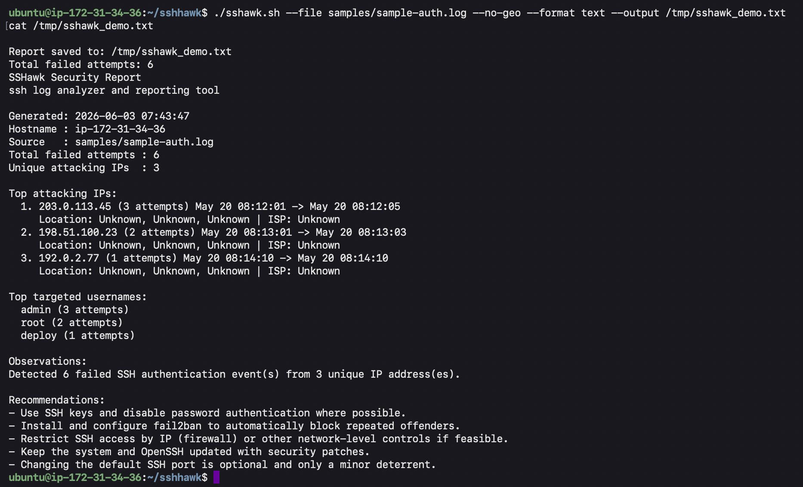
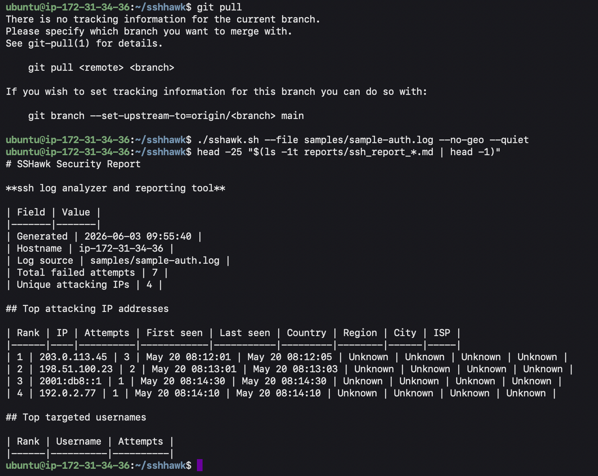

# SSHawk — Project Report

**ISEN AP3 — Introduction to Linux**  
**Repository:** https://github.com/azmogoo/sshhawk

## Authors

- Arthur WALLOIS
- Victor DAUVIN
- Francois CARPENTIER

---

## Introduction

For our Linux assignment we built **SSHawk**, a small Bash script that reads SSH authentication logs and highlights failed login attempts. The idea is simple: extract source IPs and usernames from the logs, count how often they appear, and write a short security report. We can also geolocate IPs with `curl`, but that part is optional (`--no-geo`).

The script only **reads** logs. It does not change SSH settings or block anyone — it is an analysis tool for learning and basic monitoring.

---

## Why we chose this subject

SSH is often targeted by bots and brute-force scripts. Even when nothing is compromised, you can see many `Failed password` lines in `/var/log/auth.log`. That made a good exercise for grep/awk and Bash, and we could still add something useful with `curl` for geolocation.

---

## Linux concepts used

We used standard command-line tools and Bash features expected in AP3:

- functions, arguments, conditions, loops
- `grep`, `awk`, `sed`, `sort`, `uniq`, `head`, `wc`
- reading `/var/log/auth.log` or `journalctl -u ssh/sshd`
- file permission checks (e.g. auth.log with `sudo`)
- `curl` for a public geolocation API
- temporary files and pipelines

---

## How SSH logs work

OpenSSH logs authentication events in syslog format. Lines we look for include:

- `Failed password for ... from <IP>`
- `Invalid user ... from <IP>`
- `authentication failure ... user=<username>`

These messages usually contain an IPv4 address and sometimes a username. We filter failure-related lines, then parse them line by line.

---

## How SSHawk works

**1. Collect logs** — depending on `--source`:

- `authlog` → `/var/log/auth.log`
- `journalctl` → `ssh` or `sshd` unit (we try both)
- `file` → path given on the command line (we use `samples/sample-auth.log` for tests)

**2. Find failures** — `grep` on common OpenSSH failure patterns, limited to `sshd` lines.

**3. Parse** — for each line: IP, username (when possible), timestamp (best effort).

**4. Aggregate** — count attempts per IP, first/last timestamp per IP, top usernames.

**5. Geolocate (optional)** — `ip-api.com` via `curl`, with a small delay and a cache so we do not query the same IP twice. On error we print `Unknown`.

**6. Report** — default output: `reports/ssh_report_YYYY-MM-DD_HH-MM-SS.md`. Text format is available with `--format text`.

---

## Demonstration

Screenshots below were taken on our Ubuntu VM (SSH session). Files are in `docs/screenshots/`.

### Help

```bash
./sshawk.sh --help
```



### Run on the sample log

```bash
./sshawk.sh --file samples/sample-auth.log --no-geo
```

We get 7 failed attempts (including one IPv6 line) and a new report under `reports/`.



### Test script

```bash
./tests/test_sample_log.sh
```

Checks that the report exists and contains the expected IPs and totals.



### Reports folder

```bash
ls -la reports/
```

Each run creates a timestamped `.md` file (ignored by git).



### Markdown report (one file)

```bash
head -40 "$(ls -1t reports/ssh_report_*.md | head -1)"
```

In the terminal the markdown table pipes may look misaligned — that is normal. The file renders correctly on GitHub or in a markdown preview.



### Text report

```bash
./sshawk.sh --file samples/sample-auth.log --no-geo --format text --output /tmp/sshawk_demo.txt
cat /tmp/sshawk_demo.txt
```

Easier to read directly in the shell.



### Debug mode

```bash
./sshawk.sh --file samples/sample-auth.log --no-geo --debug
```



---

## Results on the sample log

The sample file uses fake IPs only (documentation ranges). On our tests:

| | |
|---|---|
| Total failed attempts | 7 |
| Unique IPs | 4 |
| Main targets | admin (3), root (2), deploy (1), ipv6user (1) |
| Top IP | 203.0.113.45 (3 attempts) |
| IPv6 example | 2001:db8::1 (documentation range) |

---

## Extra features

We also implemented:

- **More failure patterns** in `grep` (keyboard-interactive, max auth attempts, disconnect messages, etc.)
- **IPv6 parsing** via `extract_ip_from_line()` (`from … port` and `rhost=`)
- **Optional scheduling** — `docs/SCHEDULING.md`, `scripts/run_scheduled_report.sh`, `systemd/sshawk-report.timer`

### IPv6 and updated totals (capture 7)

```bash
./sshawk.sh --file samples/sample-auth.log --no-geo --quiet
head -25 "$(ls -1t reports/ssh_report_*.md | head -1)"
```

The report shows **7** failed attempts, **4** unique IPs, including documentation IPv6 address `2001:db8::1`.



---

## Problems we ran into

- On some systems the journal unit is `ssh`, on others `sshd` — we check which one works.
- Usernames are not always in the same format (`Failed password` vs `authentication failure` with `user=`).
- With `set -u`, our `trap` on exit had to use `${tmpdir:-}` or the script crashed at the end.
- Geolocation sometimes returns `Unknown` (network/API) — `--no-geo` is fine for demos and tests.
- Using `head reports/*.md` prints every report at once; for a clean screenshot we use a **single** file (see command above).

---

## Privacy

Real auth logs can contain sensitive data. We only committed a **fake** sample log. Do not push real logs or production reports to a public repo.

---

## Possible improvements

- JSON export for other tools
- HTML report template
- streaming parser for very large log files

---

## Conclusion

SSHawk meets our AP3 Linux goals: Bash scripting, log analysis with standard CLI tools, optional geolocation, and clear reporting. All planned features for this project are implemented; tests on the sample file pass. The repository and documentation are on GitHub: https://github.com/azmogoo/sshhawk
